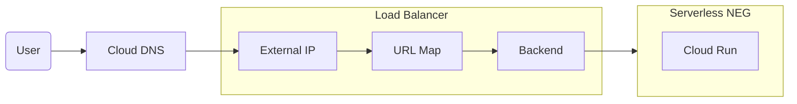

# sfujiwara.com

[](https://github.com/sfujiwara/sfujiwara/actions/workflows/config.yaml)

https://sfujiwara.com

## Architecture



## Deployment

### Terraform

```shell
make terraform-apply
```

### Docker Image

```shell
make docker-build
make docker-push
```

### Cloud Run

```shell
make cloud-run-deploy
```

### Memo

- Fix name server settings of registrar (onamae.com)
